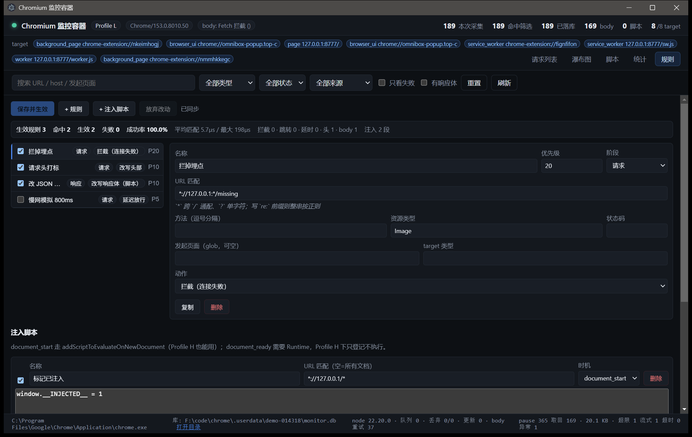

# Chromium 监控容器

对 Chromium 实例做全量观测与运行时干预。

**文档入口**：`docs/使用手册.md`（怎么用 / 面板 / 任务 recipe / API / MCP / 排障）·
`docs/设计文档.md`（架构 / 模块 / 决策记录 / 测试策略）·
`docs/技术方案.md`（需求级完整方案）·
`docs/AI-控制面.md`（HTTP API 与 MCP 的对外契约）。

## 当前状态

**P0 骨架 + P1 采集层 + P2 看板 + P3 干预 + P5 代理 + P6 探针与自动化已完成**（§7.1 那 9 个面板里做完的是
请求列表 / 请求详情 / 脚本管理 / 规则编辑器 / 注入脚本 / 控制台 / 环境与指纹；
DOM 与元素检查、会话管理也已落地；AI 控制面（本地 HTTP API + MCP server）见 `docs/AI-控制面.md`）。
只剩 P4（自编译 + patch）与 P7 未做。
验证环境：Chrome 153.0.8010.50 / Windows 11。

| 能力 | 状态 |
| --- | --- |
| `--remote-debugging-pipe` 连接（不开网络端口） | ✅ |
| 多 target attach（page / OOPIF / Worker / Service Worker） | ✅ |
| 网络请求全量采集与归一化 | ✅ |
| 响应体采集（`Fetch` Response 阶段拦截 + hash 去重 + LRU） | ✅ |
| 落盘（独立存储进程 + SQLite，NDJSON RPC over stdio） | ✅ |
| JS 源码采集（`Debugger.scriptParsed`，覆盖外链/内联/eval/Worker/SW） | ✅ |
| 看板：列表 / 瀑布图 / 统计 / 脚本 / 详情（body / 源码 / 头 / 发起链） | ✅ |
| 虚拟滚动 + 分页拉取（10 万条实测 137fps，见下） | ✅ |
| 规则引擎（7 种动作 / host 分桶匹配 4~6µs / 规则文件热加载） | ✅ |
| 看板「规则」面板（表单编辑 + 注入脚本 + 实时命中统计） | ✅ |
| 请求改写：拦截 / 跳转 / 延时 / 改请求头 / 改响应头 | ✅ |
| 响应改写：改 body（沙箱脚本）/ 伪造响应 / fixture mock | ✅ |
| 注入脚本（`document_start` / `document_ready`，按 URL 匹配） | ✅ |
| 检测探针（L 走 `Runtime.evaluate` / H 走注入 + 信标回传） | ✅ |
| 环境与指纹面板（能力矩阵 / 四分组探针报告 / 指纹明细 / 输入统计） | ✅ |
| 控制台面板（表达式求值 + 结果块 + 页面 console 实时回流） | ✅ 仅 Profile L（H 无 Runtime，故意不可用） |
| 拟人化输入（贝塞尔弧线 + 变速 + 停顿 + 错字回退，同 seed 可复现） | ✅ |
| 窗口摆正（minimized→normal 强制 ShowWindow + 回读重试） | ✅ |
| 本地代理接入（自签 MITM + SPKI pin，不碰系统信任库） | ✅ 默认关，`MONITOR_PROXY=1` 开 |
| 代理侧网络时序：DNS / TCP / TLS / TTFB / download + 上游 IP / TLS 套件 / ALPN | ✅ |
| 三源关联（CDP 为主键，代理补时序），长连接收工补报 + 晚配 | ✅ 受控 189/189，`ambiguous=0` |
| 大 body 改写下沉到代理层（`content-length` 分界，与 CDP 互补） | ✅ A/B 实测 6/6 |
| 瀑布图网络分段 + 关联状态色标 + 排队段；详情面板三源/上游/TLS | ✅ |
| DOM 与元素检查面板（DOM 树 / 命中样式 / 事件监听器，按需启用 DOM+CSS+Overlay） | ✅ |
| 会话管理面板（实例列表 / profile 切换 / 存储分区） | ✅ 切 Profile 是收工重启，不是热切 |
| AI 控制面：本地 HTTP JSON API（`127.0.0.1` + Bearer token） | ✅ 33/33（`npm run test:control`） |
| AI 控制面：截图（视口 / 整页 / 元素，落盘 + MCP image 块） | ✅ 尺寸与图片头、页面文档尺寸逐条对照 |
| AI 控制面：MCP server（stdio，25 个工具，与 HTTP 同源） | ✅ 工具清单/参数/返回逐条验收 |
| AI 控制面：页面导航（`monitor_navigate`，等 load 再回读落地 URL/标题） | ✅ |
| AI 控制面：请求头 / 响应头 / 发起链（initiator 调用栈） | ✅ 页面主线程请求全有；Worker/SW 会话内核不发 ExtraInfo（见已知限制） |
| AI 控制面：`monitor_input` 可直接给 selector（不用自己算坐标） | ✅ 16/16（`npm run test:input`） |
| AI 控制面：纯 MCP 的端到端演练（agent 视角跑完整条链路） | ✅ 39/39（`npm run test:drill`） |
| 全量冒烟：控制面 29 条路由 + MCP 25 个工具逐个真调用 | ✅ 59/59（`npm run test:smoke`） |


### 验收数据

`npm run verify` —— 起一个受控 origin，它自己记 access log 当真值，与监控库逐条对照：

```
chrome 内核      Chrome/153.0.8010.50
origin 记录      189 条
监控库记录       189 条
漏抓             0 条 (0.00%)      设计指标 < 1%
多出             0 条
body 落盘        169/189 条，2068.1 KB
页面行为覆盖      3/3（含 Service Worker 路径）
采集侧 189 请求 / target 8
存储侧 写入 189，更新 7，被约束丢 0，队列残留 0，丢弃 0
body 关联 重试 42，转收尾 0，确认真丢 0
```

存储自检 `npm run test:storage` **54/54 通过**；存储吞吐实测 **36,697 行/秒**
（20000 条 / 545ms，设计指标 1 万/秒）。

`npm run test:scripts` —— 脚本采集验收 **9/9 通过**：外链 / iframe / Worker /
Service Worker / 内联脚本都拿到了逐字一致的源码，同内容脚本按 hash 去重
（同一份 `/dup1.js` 出现 2 次只存 1 份），11 条脚本全部带源码。

`npm run test:ui-perf` —— 列表性能验收 **5/5 通过**。灌 10 万条，让看板把这 10 万条
**全部加载进渲染进程**，再从外部（CDP）驱动滚动、量相邻两帧的间隔：

```
加载 100189/100189 条用了 17594ms
滚动 897 帧 / 5631ms = 159.3fps
帧间隔 p50 6.1ms  p95 8.3ms  p99 11.3ms  max 14.1ms
>16.7ms 0 帧  >33.4ms 0 帧
[参考·不进判据] 极限压力（每帧整屏换行）899 帧 = 106.7fps，p95 14.6ms，max 31ms
```

> 探针**不驻留在产品代码里**：给 Electron 挂上 `--remote-debugging-port`，
> 「滚起来 + 量每一帧的间隔」整套从外部注入。这个数字只有验收关心，
> 没必要为它长期在渲染进程里养一段代码。

`npm run test:page-perf` —— §12「对页面的性能影响」验收 **3/3 通过**。三臂对照
（无监控 / Profile L / Profile H），同一台机器、同一个 `chrome.exe`、同一份负载页，
数字由页面自己量完 POST 回受控 origin —— 基线臂压根没有 CDP，只有这条路三臂通用：

```
                      base     Profile L   Profile H    L/base   H/base
cpu 纯计算            9.9ms      11.2ms      10.6ms      1.13×    1.07×
dom 5000 节点        27.1ms      28.1ms      27.9ms      1.04×    1.03×
net 120 请求        616.8ms     631.2ms     631.9ms      1.02×    1.02×
work 判据负载       654.4ms     680.0ms     673.5ms      1.04×    1.03×
判据 L < 2× / H < 1.3×                                     ✓       ✓

[最坏情况] 服务端思考时间 0（loopback 零延迟，页面耗时全部贴着监控）
net                  79.8ms     176.0ms     167.7ms      2.21×    2.10×
work                152.6ms     227.8ms     217.4ms      1.49×    1.42×  ← H 超 1.3×
绝对开销                                     +96ms       +88ms   ≈0.8ms/请求
```

> 0.8ms/请求是这套 CDP 拦截的物理下限（请求/响应各一次暂停放行 + body 采集），页面
> 耗时越短越密，比值越难看 —— 所以判据的参照系是真实页面（服务端思考时间 15ms/请求），
> 不是 loopback 的零延迟。两个数都写进 §12，不挑好看的那个。

`npm run test:rules` —— 规则引擎自检 **59/59 通过**（匹配语义 / 动作语义 / 沙箱边界 /
坏规则处理 / 规则文件读写 / 匹配开销）。

`npm run test:rules:e2e` —— 干预端到端验收 **22/22 通过**。真开浏览器 + 受控 origin，
除下面这些，还有一组「关掉 body 采集」的对照（响应规则与请求阶段的规则都必须照旧生效）：
探针页把「它实际看到的」回报给 origin（body 被改成什么、响应头有没有、注入脚本跑没跑、
delay 有多久），origin 的 access log 当网络层真值（被拦/被伪造的请求**不该**出现）：

```
响应体改写：页面读到的 JSON 是改过的        ✓
响应头改写：页面读到 x-monitor-resp         ✓
请求阶段拦截：fetch(/missing) 被拒          ✓
伪造响应 / fixture 伪造 / 请求跳转 / 延时放行  ✓
注入脚本：document_start 在页面里跑过        ✓
改写的请求头真的发出去了（origin 侧核对）     ✓
block / fulfill / mock 的请求没到 origin     ✓
每种动作都真的跑过  blocked=1 redirected=1 delayed=1
                    headersRewritten=3 bodiesRewritten=1 fulfilled=2 failed=0
§12 改写成功率 ≥ 99%                         ✓ 100%（9/9）
```

> §6.2 的匹配开销以 `test:rules` 里 2000 条规则的压测为准（**4~6µs/次**）。
> 端到端里的 `avgMatchUs` 是 30~40µs 量级，但那个数字不能当指标看 ——
> 只有个位数规则、样本 9 次，量的是首次编译与冷启动抖动。

> 顺手修掉的一条：`MONITOR_CAPTURE_BODIES=0` 时响应规则会**静默失效**（`Fetch.enable` 的拦截范围原先只由
> 请求阶段的规则反推）。现在 `engine.responsePatterns()` 把它补上（只在采集关掉时补发，避免和
> resourceType pattern 重叠），上面两组对照就是它的验收。

> 「同一条响应只应用一次」另有直接验收：`node work/double-apply-check.mjs` **2/2** —— 判据是**非幂等**
> 脚本，幂等脚本（split/join 那种）根本验不出重复应用。

> 那 7 次「更新」是设计内的：不消费响应体的请求（`fetch(u).then(r => r.status)`）Chrome 不发 `Network.loadingFinished`，所以先落一行 pending，等收尾或终态再 upsert。

`npm run test:proxy` —— P5 代理验收 **24/24 通过**（真开 Chrome + 自签 MITM + 受控 origin）。
覆盖面：证书按 host 现签且 SPKI 跨重启恒定（pin 才不失效）、明文 http 的 absolute-form、
DNS/TLS/TTFB/download 齐全且**复用连接上不再有 dns/connect/tls**、压 gzip 的响应解码后再改写、
超 `rewriteMaxBytes` 退化成透传且不截断、改后 `content-length`/`content-encoding` 对齐，
以及大 body 下沉的四条边界（`== sinkAboveBytes` 不下沉 / chunked 不下沉 / 二进制不下沉 /
同一 URL 命中多条只执行第一条）。关联算法本身另有 `npm run test:correlate` **30/30**。

`node scripts/test-proxy-e2e.mjs` —— 三源关联端到端 **10/10**：受控 origin 一次发 189 条，
**受控范围关联率 1.0、两侧零孤儿、DNS/TLS 齐全**（`MONITOR_PROXY=1 npm run verify` 也能看到同一组数字）。

`node work/sink-e2e.mjs` —— 大 body 改写下沉的 A/B **6/6**。判据由**页面自己**回报给 origin，不靠引擎自述：

```
                     /big ≈ 400KB         /small 小 body      应用侧计数
开代理 PROXY=1       REWRITTEN（代理）    REWRITTEN（CDP）    tooLarge=1  bodiesRewritten=5
关代理 PROXY=0       ORIGINAL             REWRITTEN（CDP）    tooLarge=1  bodiesRewritten=5
```

> 分界判据是 `content-length`：CDP 那条路 `declared > bodyMaxBytes`（256KB）就不取 body，
> 代理按 `declared > sinkAboveBytes` 判，主进程把两者设成同一个数 → 两边互补、绝不重叠。
> 重叠会把同一条 body 改两遍（脚本不一定幂等），比漏改严重得多。

`npm run test:probe` —— P6 检测探针验收 **14/14 通过**。两个 Profile 各起一次容器，从外部挂 CDP 到控制窗口，
模拟「切到环境面板 → 点运行探针 → 展开所有分组 → 把表格逐行读回来」，断言全做在报告数据上（分组归属显式带着，不靠行序猜）：

```
Profile L（直连）
  面板出了报告 / 四分组有内容 / 指纹 12 项且 UA 取到        ✓
  检出硬痕迹：console 调用耗时 31.25µs（无调试器约 5µs）    ✓
  建议切 Profile H                                          ✓
  能力矩阵与 Profile 一致                                   ✓
Profile H（隐蔽）
  CDP 痕迹零失败（§12 隐蔽性）                              ✓
  自动化标记零失败（outerWidth/Height = 1280x900 …）        ✓
  建议保持 Profile L（无痕迹）                              ✓
  注入 + 信标回传通道可用（§3.5 雏形，一回 518ms）          ✓
```

`npm run test:input` —— 拟人化输入验收 **16/16 通过**。判据不是「调用没报错」，而是**页面侧录到的真实事件轨迹**：

```
move   68 个轨迹点 / 1167ms / 路程 658px 对直线 611px（走的是弧）
       最大步长 25px / 单步间隔 4.3~39.8ms / 2 次停顿 / 全部 isTrusted ✓
       落点精确到 1150,700；同一个 seed 重放两次，派发点数与规划路程完全一致 ✓
click  落在 #target 上，mousedown/mouseup 成对且按住 > 5ms            ✓
click  只给 selector 就点中 #target（元素中心自己解，不必给坐标）     ✓
click  选择器不存在 → 明确报错，不静默点 (0,0)                        ✓
type   配 selector 先聚焦再敲键，文本真的进到那个框里                 ✓
type   文本真的进了输入框，按键节奏 CV > 0.15                        ✓
scroll 拆成多次滚轮，总量正好 600                                   ✓
导航后   跳转落地后立刻点 #target，墙钟 < 10s（防「5s/次回执」回归）  ✓
面板   点「移动」出轨迹统计                                          ✓
```

> 验收脚本自带一个行为检测器（单步 > 60px、间隔 CV < 0.12、步长 CV < 0.1、直线度 < 1.005、
> `isTrusted=false` 任一命中即判机器），并且**先证明它有判别力** —— 把「一次跳到位」的两点假轨迹
> 喂进去必须被判死；否则「我们的轨迹通过了」这句话不算数。

`npm run test:dom` —— DOM 与元素检查面板验收 **19/19 通过**。真开浏览器 + 受控 origin 的 `/dom-probe.html`，
先验证数据本身，再走面板 UI 那条路（点箭头 / 选节点 / 切 tab 全从外部驱动）：

```text
树干与层级 / 懒展开一层                                   ✓
选择器命中 / 未命中 / 选择器语法错                        ✓
outerHTML 与页面逐字一致                                  ✓
盒模型对 getBoundingClientRect                            ✓
覆盖判定（被盖元素标删除线 / 赢者不被标 / 赢者排前 / computed 色 = rgb(0,128,0)）✓
行内样式优先级最高（inline 真的排在规则页前面）           ✓
事件监听器 click / pointerdown（含 passive）              ✓
不依赖 Runtime（Profile H 下 DOM/CSS/Overlay 按需启用）   ✓
高亮开/关 / 页面导航后缓存失效提示「重取 DOM 树」        ✓
```

`npm run test:sessions` —— 会话管理面板验收 **9/9 通过**。真开浏览器，判据是**逐条对数据库**，不是读界面自述：

```text
实例列表 current = 唯一 live 实例                         ✓
每实例计数与库里 COUNT(*) 逐条对                          ✓
存储分区对磁盘（含 WAL）与各表行数                        ✓
切 Profile H：新 inst + profile 变 + 库多一行 + 旧行补 ended_at ✓
新实例照样入库 / 切回 L 继续累加                          ✓
面板 UI 点按钮切换（提示文案 + 表格行数 + 库行数）        ✓
```

> 切 Profile 走的是**收工重启**，不是热切：启动参数（FD 3/4、remote-debugging-pipe）、domain 白名单、
> 采集侧 Debugger 通道都钉在浏览器生命周期里，热切等于换一套浏览器行为，不如说清「换 profile = 起重开一个」。
`npm run test:control` —— AI 控制面验收 **33/33 通过**。判据分三层：发现与鉴权（`control.json` 带 port/token、
不带 token 必须 401、`/health` 免鉴权、未知路径回 404）、数据面（每个接口都要与另一处真值对上：
假过滤条件查不到 / 真条件查得到、`/requests/:seq` 与列表里那条逐字一致、`/dom/tree` 真有 html/body、
`/dom/inspect` 给出盒模型/命中样式/监听器、`/screenshot` 落盘的 PNG/JPEG 与页面文档尺寸对得上、`/probe` 真跑出检测项）、MCP（真 stdio JSON-RPC：
`tools/list` 列全 25 个工具且都有 description + inputSchema、`monitor_status`/`monitor_requests`
与直接 HTTP **逐字一致**、未知工具回 `isError` 后连接仍可用）。

```text
control.json 写出来且带 port/token                       ✓
没带 token 的请求被拒（401）                             ✓
/health 免鉴权可用 / 未知路径回 404                      ✓
status 反映真实会话（connected + 有请求 + control 端口） ✓
/requests 分页结构（total/rows，limit 生效）             ✓
/requests/:seq 与列表里那条是同一个请求                  ✓
假过滤条件查不到、真条件查得到 / domain→host / q→search  ✓
/dom/tree 与 /dom/inspect（盒模型 + 命中样式 + 监听器）  ✓
POST /probe 真的跑出报告 / /evaluate / /input 有轨迹统计 ✓
MCP：25 个工具全带 description + inputSchema             ✓
MCP 与 HTTP 结果逐字一致（status / requests / dom）      ✓
未知工具 isError 且之后连接还能用                        ✓
/screenshot 落盘 PNG/JPEG：图片头尺寸 = 文档尺寸          ✓
MCP monitor_screenshot 带回 image 块（与落盘同一张）     ✓
```

`npm run test:detail` —— 请求详情那条链的验收 **8/8 通过**（真开浏览器 + 一个「自己在页面里发起
`fetch`」的探针页）。判据全是「逐字对上」，不是「字段非空」：

```text
库里真落了 initiator_stack（直接开库看，不是接口自述）        ✓
第一帧函数名逐字是 probeInitiatorFetch（不是「有栈」就算）    ✓
initiator 过滤真生效（script 查得到 / parser 查不到）         ✓
详情接口 /requests/:seq 里读得到同一份发起链                  ✓
面板「发起链 (N)」tab 里看得到函数名（走 UI 那条路）          ✓
```

`npm run test:drill` —— **纯 MCP 的端到端演练 39/39 通过**。整场只走 `mcp/server.mjs` 的
stdio JSON-RPC：不 import 项目内部模块、不直接连调试端口 —— 这里跑的每一步，外部 agent 都能跑。
判据落在页面侧与库里的真值上，不是「调用没报错」：

```text
control.json 发现 → MCP 握手 → tools/list（25 个）               ✓
status / capabilities / requests / request / body / fetch_body   ✓
scripts / script_source / console / evaluate / timeline           ✓
dom_tree / dom_inspect / dom_highlight / screenshot（image 块）   ✓
input 说「点 body」就能点（selector，不用给坐标）                 ✓
rules_set → navigate → 拦掉的请求真的不再 200 → rules_stats       ✓
probe：L 下如实报出 Runtime 痕迹（检不出才是探针失效）           ✓
sessions / switch_profile H（evaluate 被拒）/ 切回 L / clear      ✓
未知工具 isError、查不存在的 seq 不会把连接搞死                   ✓
应用重启：旧端点失效时如实报错 → 重启后同一个连接自动接回来        ✓
```

> 这两条一起构成「agent 真能用」的判据：`test:control` 证明接口与 MCP 同源，
> `test:drill` 证明**只用 MCP** 就能从头到尾干完一件活（写规则 → 验证拦截真的生效）。

## 干预规则（P3）

看板最后一个 tab 是「规则」。左边列规则，右边编匹配与动作，底部管注入脚本，
顶部条实时显示命中/生效/失败与成功率。改动要按「保存并生效」才写入规则文件
（默认 `<数据目录>/rules.json`，可用 `MONITOR_RULES` 换路径），重启后自动加载。



规则文件的形状就是 `RuleSet`：

```jsonc
{
  "version": 1,
  "rules": [
    { "id": "r1", "name": "拦掉埋点", "enabled": true, "priority": 20,
      "stage": "request",                                    // request | response
      "match": { "urlPattern": "*://tracker.example.com/*",  // glob（`*` 跨 `/`）或 `re:` 正则
                 "method": ["POST"], "resourceType": ["XHR"],
                 "frameUrl": "*://app.example.com/*", "targetType": ["page"] },
      "action": { "kind": "block" } },
    { "id": "r2", "name": "本地 mock", "enabled": true, "priority": 10,
      "stage": "request",
      "match": { "urlPattern": "*://api.example.com/v1/user" },
      "action": { "kind": "mock", "fixture": "demo" } },
    { "id": "r3", "name": "改响应体", "enabled": true, "priority": 5,
      "stage": "response",
      "match": { "urlPattern": "*://api.example.com/v1/*", "statusCode": [200] },
      "action": { "kind": "rewriteBody",
                  "script": "const data = JSON.parse(body); data.flag = 1; return JSON.stringify(data)" } }
  ],
  "fixtures": { "demo": { "status": 200, "headers": { "content-type": "application/json" }, "body": "{\"ok\":true}" } },
  "injections": [
    { "id": "i1", "name": "标记", "enabled": true, "urlPattern": "*://app.example.com/*",
      "code": "window.__MONITORED__ = 1", "runAt": "document_start" }
  ]
}
```

七种动作：`block` / `redirect`（支持 `$URL`、`$HOST` 占位）/ `delay`（上限 30s）/
`rewriteHeaders`（`set` + `remove`）/ `rewriteBody`（沙箱脚本，`(body, ctx) => string`，
返回非字符串=不改）/ `fulfill` / `mock`。

语义上有意收窄的地方，都是为了让「这条规则会怎样」说得清：

- **每个阶段只应用优先级最高的一条命中规则**（同优先级按列表顺序），不做链式叠加
- **动作与阶段强绑定**：`rewriteBody` 只能在响应阶段，`block`/`redirect`/`delay` 只能在请求阶段；
  配错了不会静默生效，会以「被丢弃」的形式出现在面板上
- **二进制响应不改写**（base64 往返会毁字节），**坏规则不炸管道**（编译期丢弃 + 报原因）
- `document_start` 注入走 `Page.addScriptToEvaluateOnNewDocument`，**Profile H 下也能用**；
  `document_ready` 需要 `Runtime`，Profile H 下只登记不执行

## 命令

```bash
npm install
npm run dev                # 启动看板（默认打开 https://example.com）
npm run typecheck
npm run build
npm run test:storage       # 存储进程自检（54 项）
npm run test:scripts       # 脚本采集验收（9 项，会真开浏览器）
npm run test:rules         # 规则引擎自检（59 项，纯逻辑，不碰浏览器）
npm run test:dom           # DOM 与元素检查面板验收（19 项，真开浏览器 + 受控 origin）
npm run test:sessions      # 会话管理面板验收（9 项，实例/存储/profile 切换）
npm run test:rules:e2e     # 干预端到端验收（22 项，真开浏览器 + 受控 origin）
npm run test:proxy         # P5 代理验收（24 项，真开 Chrome + MITM + 受控 origin）
npm run test:correlate     # 三源关联自检（30 项，纯逻辑）
npm run test:ui-perf       # 列表性能验收：灌 10 万条 + CDP 驱动滚动量帧率
npm run test:page-perf     # §12 性能影响验收：三臂对照（无监控 / L / H），3 轮取中位
npm run test:probe         # P6 检测探针验收（14 项，两个 Profile 各起一次容器）
npm run test:input         # P6 拟人化输入验收（16 项，判据是页面侧的轨迹 / selector 定位）
npm run test:control       # AI 控制面验收（33 项：HTTP API + MCP，真开浏览器）
npm run test:detail        # 请求详情验收（8 项：头 / 发起链 / initiator 过滤，真开浏览器）
npm run test:drill         # agent 演练（39 项：只走 MCP stdio，到「规则真的生效」为止）
npm run test:smoke         # 全量冒烟（59 项：29 条 HTTP 路由 + 25 个 MCP 工具，一条都不落）
npm run verify             # 采集完整性验收（起受控 origin 对照，会真开浏览器）
npm run demo -- 30000 15 out.png   # 跑一次看板，15s 后截图到 out.png，30s 后收工
npm run mcp -- --data-dir=<数据目录>   # 以 MCP server 形式接出去（stdio，给 agent 用）
node scripts/probe-pipe.mjs        # 单独验证 pipe 是否可用，排查环境问题用
node scripts/db-sql.mjs <db> "select url,status from requests limit 5"   # 直接查库
```

## 环境变量

| 变量 | 作用 |
| --- | --- |
| `MONITOR_URL` | 起始 URL，默认 `https://example.com` |
| `MONITOR_PROFILE` | `L`（默认）或 `H` |
| `MONITOR_HEADLESS` | 设为 `1` 走 headless |
| `CHROME_PATH` | 指定内核路径，不设则自动查找 |
| `MONITOR_DATA_DIR` | 数据目录（验收要干净 profile，SW 会残留） |
| `MONITOR_DB` / `MONITOR_PROFILE_DIR` | 覆盖库路径 / profile 路径 |
| `MONITOR_NODE_PATH` | 存储进程用的 node，默认自动查找系统 Node 22 |
| `MONITOR_STORAGE_SERVER` | `storage/server.mjs` 路径 |
| `MONITOR_AUTO_QUIT_MS` | N ms 后体面收工 |
| `MONITOR_QUIT_FILE` | 出现该文件即收工 |
| `MONITOR_UI_TAB` | 开局面板 `list` / `waterfall` / `stats` |
| `MONITOR_UI_SELECT` | 开局自动选中（URL 子串） |
| `MONITOR_UI_DTAB` | 详情面板开局 tab `overview` / `headers` / `body` |
| `MONITOR_RULES` | 规则文件路径，默认 `<数据目录>/rules.json`；面板保存也写这里 |
| `MONITOR_TRACE` | URL 子串命中就打印该请求的生命周期事件流水 |
| `MONITOR_CAPTURE_BODIES` | `0` 关闭 body 采集 |
| `MONITOR_BODY_MAX_KB` | 单个 body 上限，超限只留摘要 + hash |
| `MONITOR_BODY_STORE_MB` / `MONITOR_BODY_STORE_COUNT` | 库内 body 总容量（LRU 淘汰） |
| `MONITOR_BODY_TIMEOUT_MS` | 等 body 的超时，超时无条件放行 |
| `MONITOR_BODY_TYPES` | 采集 body 的 resourceType 白名单 |
| `MONITOR_CAPTURE_SCRIPTS` | `0` 关闭 JS 源码采集（只在 Profile L 生效） |
| `MONITOR_SCRIPT_MAX_KB` | 单个脚本源码上限，默认 2048，超限只留 url/size/hash |
| `MONITOR_SCRIPT_MAX_COUNT` | 本次会话最多取多少个脚本的源码，默认 3000 |
| `MONITOR_SCRIPT_TIMEOUT_MS` | 单个 `getScriptSource` 超时，默认 4000 |
| `MONITOR_SCRIPT_CONCURRENCY` | 取源码的并发上限，默认 4 |
| `MONITOR_PROXY` | `1` 开本地代理（默认关）。开了才有 DNS/TLS 时序与大 body 改写 |
| `MONITOR_PROXY_KEY` | 代理 CA 私钥路径，默认 `<数据目录>/proxy-ca.key`（复用同一把，SPKI 才跨重启不变） |
| `MONITOR_PROXY_REWRITE_MB` | 代理侧改写上限，默认 32，超了透传不截断 |
| `MONITOR_PROXY_WINDOW_MS` | 三源关联窗口，默认 1000（实测 50ms 时关联率只有 21.2%） |
| `MONITOR_PROXY_UPSTREAM_VERIFY` | `0` 关上游 TLS 校验，只给自签上游的测试用 |
| `MONITOR_API` | `0` 关掉 AI 控制面（默认开）。做「零额外监听面」验收时用 |
| `MONITOR_API_PORT` | 控制服务端口，默认 `0` 让系统分配；实际端口写在 `<数据目录>/control.json` |
| `MONITOR_CONTROL_URL` | MCP server 直接指定控制服务地址（含 token），不读 control.json |

> 环境变量不跨 `exec_command` 保留 —— 设置和运行要写在同一条命令里。

## 目录结构

```
docs/使用手册.md              使用手册：上手 / 面板 / 任务 recipe / API / MCP / 排障
docs/设计文档.md              设计文档：架构 / 模块职责 / 决策记录 / 测试策略
docs/技术方案.md              需求级完整方案（目标、路线 P0–P7、验收指标）
docs/P4-P7-待办与阻塞.md       P4（自编译 Profile H）/ P7 的缺口实测与最小推进路径
docs/AI-控制面.md             AI 控制面设计：HTTP API / MCP / 鉴权 / 地址发现
control/server.mjs            控制服务（本地 HTTP API + 上游 NDJSON 桥）
mcp/server.mjs                MCP server（stdio，把控制面映射成 25 个工具）
storage/server.mjs            存储进程（node:sqlite，NDJSON RPC over stdio）
proxy/server.mjs              本地代理进程（自签 MITM + 时序 + 大 body 改写，NDJSON over stdio）
proxy/correlate.mjs           三源关联（CDP 为主键 + 窗口 + 晚配 + drain 补报）
proxy/rule-sandbox.mjs        body 脚本沙箱（主进程与代理共用的同一份实现）
scripts/
  probe-pipe.mjs              pipe 连通性自检
  test-storage.mjs            存储进程自检（54 项）
  test-scripts.mjs            脚本采集验收（9 项）
  test-ui-perf.mjs            列表性能验收（灌 10 万条 + CDP 驱动滚动）
  test-page-perf.mjs          §12 性能影响验收（三臂对照，判据取页面稳态负载）
  app-harness.mjs             面板验收通用驱动（起 Electron + 连 CDP + 求值 + 截图）
  test-control.mjs            AI 控制面验收（33 项：HTTP API + MCP，真开浏览器）
  test-dom.mjs                DOM 与元素检查面板验收（19 项）
  test-sessions.mjs           会话管理面板验收（9 项）
  test-rules.mjs              规则引擎自检（59 项，纯逻辑）
  test-rules-e2e.mjs          干预端到端验收（22 项，真开浏览器）
  test-proxy.mjs              P5 代理验收（24 项，真开 Chrome + MITM）
  test-proxy-e2e.mjs          三源关联端到端（10 项）
  test-correlate.mjs          三源关联自检（30 项，纯逻辑）
  test-input.mjs              P6 拟人化输入验收（16 项：轨迹 / selector 定位）
  test-detail.mjs             请求详情验收（8 项：头 / 发起链 / initiator 过滤）
  test-agent-drill.mjs        agent 演练（39 项，纯 MCP stdio 端到端）
  test-smoke.mjs              全量冒烟（59 项：29 条 HTTP 路由 + 25 个 MCP 工具）
  mcp-client.mjs              MCP stdio 客户端（initialize / call / callJson）
  test-origin.mjs             受控 origin + 189 条请求的负载 + 探针页 / 性能负载页 / DOM 探针页
  verify-completeness.mjs     完整性验收：origin access log vs 监控库
  demo-run.mjs                跑一次看板 + 截图 + 收工
  db-sql.mjs                  直接对库执行 SQL
  cleanup-stray.ps1           清理残留进程 / 数据目录
work/                         一次性排查与验收脚本（sink-e2e / double-apply-check / shots-p5 …）
src/
  main/
    index.ts                  Electron 主进程 + IPC 装配
    controller.ts             编排：启动浏览器、连接、批处理、状态
    browser/
      locate.ts               查找内核
      launch.ts               启动参数 + spawn（fd 3/4）
      pipe-transport.ts       CDP over pipe 传输层（\0 分隔 JSON）
      cdp.ts                  命令/响应配对 + 事件分发 + session 路由
      collector.ts            多 target 网络采集与归一化
      body-capture.ts         Fetch Response 拦截 + body 存取 + LRU
      script-capture.ts       Debugger.scriptParsed → getScriptSource（含内联/Worker）
      injection.ts            注入脚本（document_start 守卫式挂载 / document_ready）
    rules/
      matcher.ts              glob/正则、host 分桶、优先级（匹配路径零分配）
      engine.ts               规则编译 + 请求/响应两阶段裁决 + 统计 + Fetch 拦截范围
      sandbox.ts              改写脚本沙箱的 TS 出口（实现见 proxy/rule-sandbox.mjs）
      store.ts                规则文件读写（坏文件退化成空规则）
    proxy/
      client.ts               代理进程 RPC 客户端（起停、规则下发、drain 补报）
      rules.ts                规则集 → 代理形状（只下发代理能等价执行的部分）
    storage/
      client.ts               存储 RPC 客户端（批处理、重试、背压）
      locate-node.ts          定位系统 Node（Electron 自己不带 node:sqlite）
  preload/index.ts            contextBridge 暴露 window.monitor
  shared/types.ts             跨层共用类型
  renderer/                   看板 UI
```

## 架构要点

**被监控的浏览器是独立进程，零污染。** 不用 Electron 承载目标页面 ——
Electron 的 `window.chrome` 不完整（缺 `loadTimes`/`csi`），是成熟的检测点。
Electron 只用来画看板，因为看板不加载目标站点，特征完全无害。

**控制通道走 pipe 而不是端口。** `--remote-debugging-pipe` 用 fd 3/4
（父进程写 fd 3、读 fd 4），`netstat` 扫不到任何监听端口。

**必须先接管，再放行。** 启动时用 `about:blank`，等所有 target attach 完
并 enable 了 Network 域，再 `Page.navigate` 到目标 URL。若直接用命令行参数
传 URL，页面首屏请求会在 attach 之前就发完，一条都抓不到。

**多 target 覆盖是底线。** `Target.setAutoAttach({ flatten: true })` 之后，
每个新 `sessionId` 都要单独 enable 一遍 domain，否则 OOPIF、Web Worker、
Service Worker 里的流量全是黑的。现代站点相当比例的请求在 Service Worker 里，
漏掉会得出完全错误的结论。

**Service Worker 必须先放行、再 enable。** 对暂停中的 SW，`Network.enable`
**永不回包**（实测挂 18s 直到管道关闭），而 `Runtime.runIfWaitingForDebugger`
就排在它后面 —— SW 卡在 install 之前，站点半死，**CDP 侧一个错都不报**。
所以 `attachedToTarget` 里遇到 `waitingForDebugger && type === 'service_worker'`，
先 `void resumeTarget(sid)`（不 await），再 `await enableSession()`。page/worker 保持原序。

**同一个 target 只认一个 session。** SW 常被 root session 和 page session 各 attach
一次，两边都带 `waitingForDebugger`。用 `primarySession: Map<targetId, sessionId>`
保证每个 target 只在一个 session 上开域，重复的记日志跳过 —— 否则请求行会重复。

**JS 源码走 `Debugger` 域，只在 Profile L 开。** `Debugger.scriptParsed` +
`Debugger.getScriptSource` 是唯一能看到内联 `<script>`、`eval`、`new Function` 的路子
（`Network` 只看得到网络加载的文件）。但 `Debugger` 是 §3.4 点名的高风险 domain，
所以 Profile H 下整条链自动失效 —— 这也正是 P6 探针要回答的问题之一。

**同一份脚本按内容 hash 全局去重。** `scripts` 存源码与元数据，`script_refs(inst, hash)`
表示「本次会话加载了哪些」。内联脚本的 `url` 是**文档 URL**而不是空串，判内联要用
`startLine > 0`（DevTools 同款判据）；列表查询刻意不返回源码，一页脚本可能几十 MB。

**代理是第三个进程，只补 CDP 给不了的东西。** `proxy/server.mjs` 是独立 node 进程
（NDJSON over stdio，同存储那套）。它做两件事：CDP 拿不到的 DNS/TCP/TLS 时序（以及上游 IP、
TLS 套件），和**大 body 改写**——大 body 走 base64 过 IPC 会把页面卡住。判据只有一条：
`content-length` 声明长度，CDP 与代理两侧用同一个阈值，正好互补。

**存储是独立进程，不是 Electron 里的模块。** 见下节。

## 存储选型（实测结论）

**用系统 Node 22 起一个独立存储进程（`node:sqlite`），NDJSON RPC over stdio。**

设计文档原先写的是「Electron 33 没有 `node:sqlite`，用 `better-sqlite3` + `electron-rebuild`」。实测这条路走不通：

- `better-sqlite3` v13 在 Electron 33 里 `require` 那一瞬间**硬崩**（exit `-36861`），
  连 `new Database()` 都到不了 —— 它虽然是 N-API prebuild，仍然不行
- 系统 Node 22.20 的 `node:sqlite` 稳定、零编译、零 ABI 风险

顺带满足设计文档 §5.2 的硬要求：**绝不在 CDP 事件回调里做同步 IO**。
重 IO 全在另一个进程，事件路径上只有内存队列。

## Profile

方案里的双通道。**Profile H 现在实现了通道那一半**：不开 `Runtime`/`Debugger`，探针靠注入 + 信标回传、
输入靠 `Input.*`、规则与采集照常跑；自编译 + 二进制 patch 那一半在 P4。

| | Profile L | Profile H |
| --- | --- | --- |
| Domain | 全开（含 `Runtime.enable`） | 白名单 `Page`/`Network`/`Fetch`/`Target`，`Runtime`/`Debugger` 不开 |
| 断点 | 支持 | 放弃，降级为 Hook + 回传（P6 已跑通：注入 + 信标回传） |
| 控制台 | 可用 | 故意不可用（H 没有 `Runtime`，求值无从谈起） |
| 探针回报 | `Runtime.evaluate` 直接取报告 | `Page.addScriptToEvaluateOnNewDocument` + 信标（Fetch 阶段 fulfill 204） |
| 指纹 | `Emulation.*` | 启动参数 + 二进制 patch（patch 那半待 P4） |
| 用途 | 开发调试、无风控目标 | 有 CDP 检测的目标 |

`Runtime.enable` 是 Profile H 的红线：它会改变 V8 里 `console` 的代码路径，
页面测一下 `console.debug()` 的耗时就知道有调试器连着。

## 已知限制

- **CDP 盲区**：浏览器自身的流量（如 `/sw.js` 的更新检查拉取）在 CDP 里根本不存在，
  设计文档 §4 已声明，不计入漏抓
- 三源已齐（CDP + 代理 + 页面探针）：代理补 DNS/TLS/真时序，页面探针补「页面实际看到了什么」
- 开代理后**出站 TLS 指纹是 Node 的**（被拦截的 host 由抓包端去连），不是 Chrome 的 JA3/JA4。
  开代理 = 用 TLS 指纹换 DNS/TLS 时序，所以默认关着；要对齐得上 uTLS 那一套（§8.1 未勾选项）
- 大 body 改写只下沉「拿得到 `content-length`」的响应：chunked / 流式（含 SSE）的两边都不改（如实记原因）；
  二进制与 CDP 那条路一样跳过（utf8 往返会把字节改坏）；带 `resourceType` / `frameUrl` /
  `targetType` 约束的 body 规则不下发到代理（代理拿不到这些信号，硬发会改错），日志会报条数
- 自编译 + 二进制 patch（P4）与自建 content 壳（P7）未做：本机缺 Chromium 源码 / GN / Windows SDK 头文件。
  **但「CIPD 不可达」那条旧结论已被证伪** —— 走本机代理 `127.0.0.1:7890` 后 CIPD 后端应答正常、
  depot_tools bootstrap 11.5 秒跑完（详见 `docs/P4-P7-待办与阻塞.md` §0，含可复现命令与完成判据）。
  看板侧 §7.1 九个面板已全部落地
- **请求头有内核侧盲区**：`req_headers`/`resp_headers` 走 `Network.*ExtraInfo`，而 Worker / Service Worker
  的会话**不发这两个事件**（实测：worker 会话只有 `requestWillBeSent`/`responseReceived`）。
  受控页实测：页面主线程的请求 100% 有头；没有头的那几条全落在 worker/SW 会话，
  以及被规则拦下（请求根本没发出去）的那一条上
- 响应阶段的**头改写**在拿不到 body 时会放弃（流式响应、超过 `MONITOR_BODY_MAX_KB` 的
  大响应、304）：CDP 没有「只改响应头」的命令，只能重发响应，而这些响应重发不起
- 规则动作只有网络与注入两类；拟人化输入（P6）目前从环境面板手动触发，没做成规则动作
- 被监控浏览器带**抗节流三开关**（`--disable-backgrounding-occluded-windows`、
  `--disable-renderer-backgrounding`、`--disable-features=CalculateNativeWinOcclusion`）：不关的话，
  窗口被别的窗口盖住时 Chromium 按「不可见」节流渲染，鼠标事件回执被拖到 ~5s、`mousemove` 被按帧
  合并。代价是页面被遮挡时仍按「可见」跑（rAF、定时器不降频）—— 跟真人在前台用浏览器一致，
  但「靠后台节流做手脚」的页面会看出这点差异
- `/input` 返回时**页面未必已经收到**：事件在浏览器队列里排队投递，实测返回后 150ms 内页面还会再
  收到 30 多个点。要「点完立刻读结果」就留 ~200ms，或把读取并进同一次 `/evaluate`
- Profile H 只实现了一半：不给 `Runtime`/`Debugger` 的通道选择已经可用（探针实测零痕迹），
  自编译 + 二进制 patch 在 P4
- 被监控窗口必须真的显示出来，页面才有 `outerWidth`/`visibilityState`。本机是有头环境（窗口会真出现在桌面上），
  纯无桌面的容器里这条会退化，详见 `docs/技术方案.md` §8.4
- body 采集计数有 +1 漂移：大 body 超限放行后页面立刻收工，
  `Fetch.requestPaused` 与 shutdown 竞态所致，在容差内
